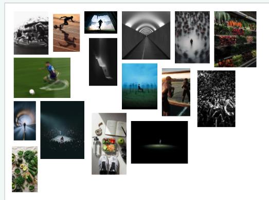
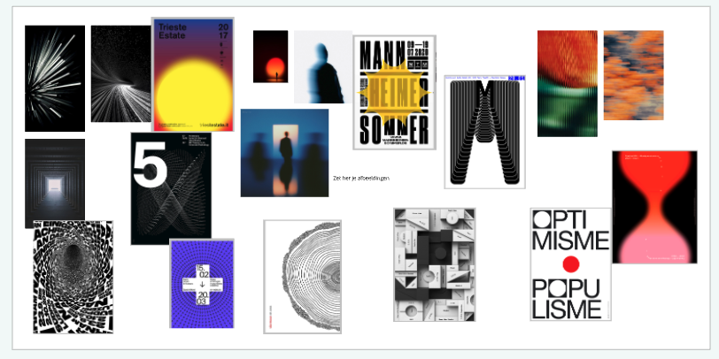
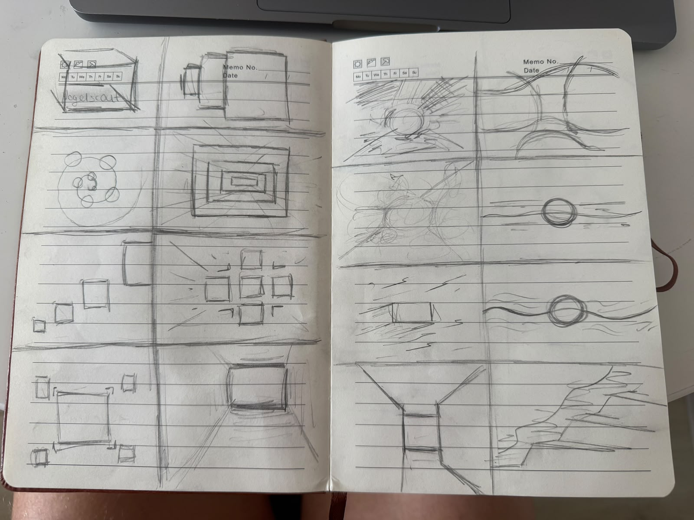
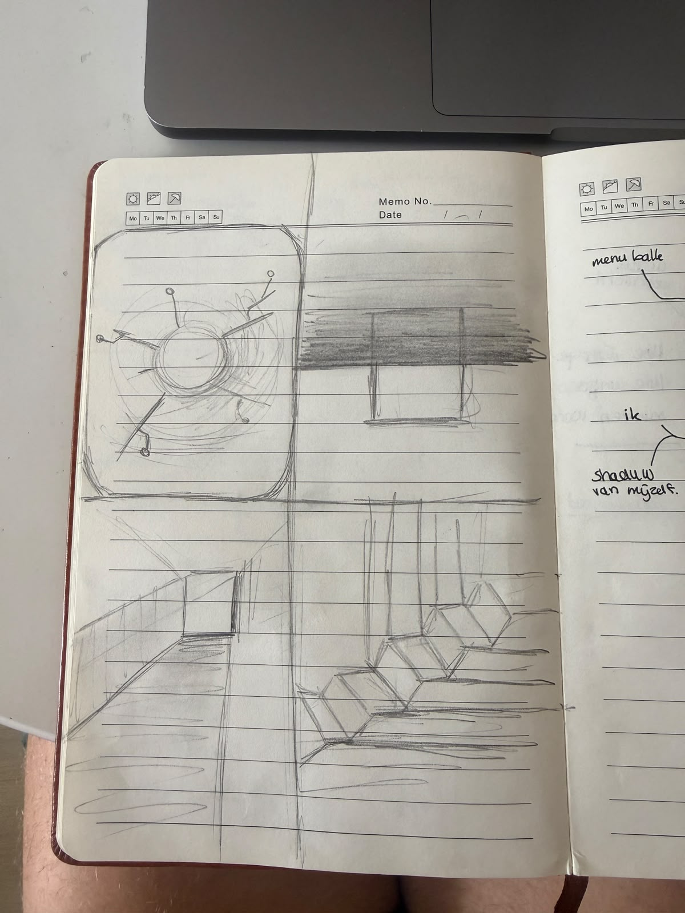
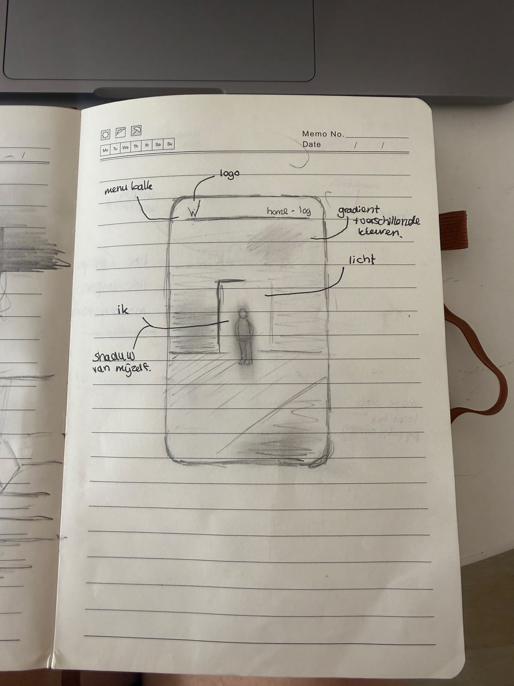
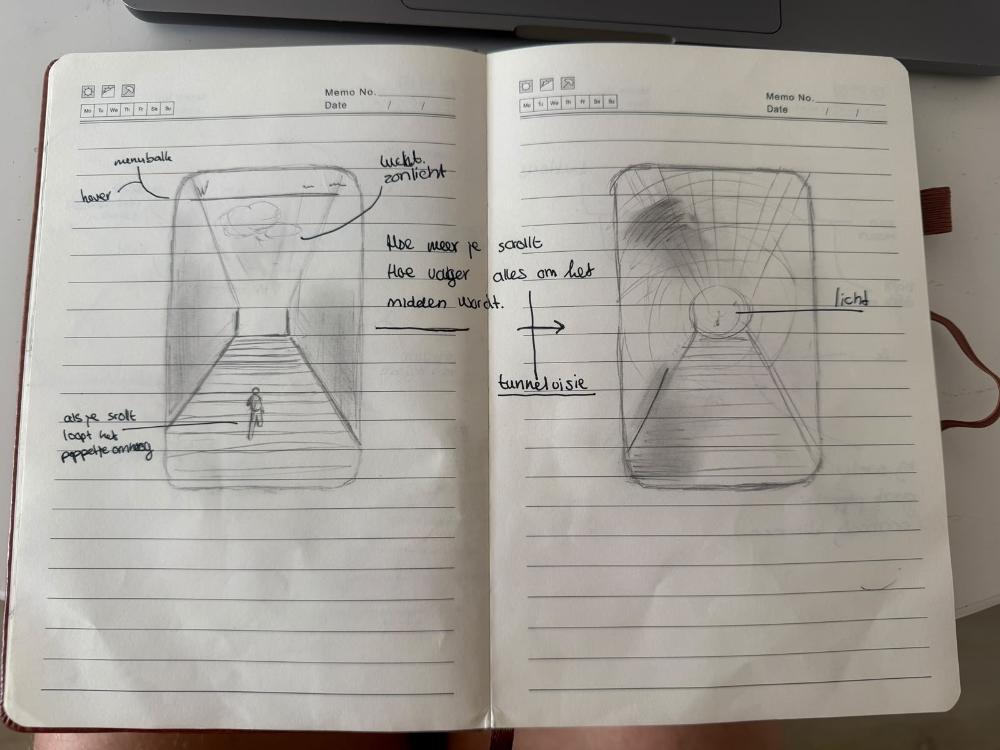
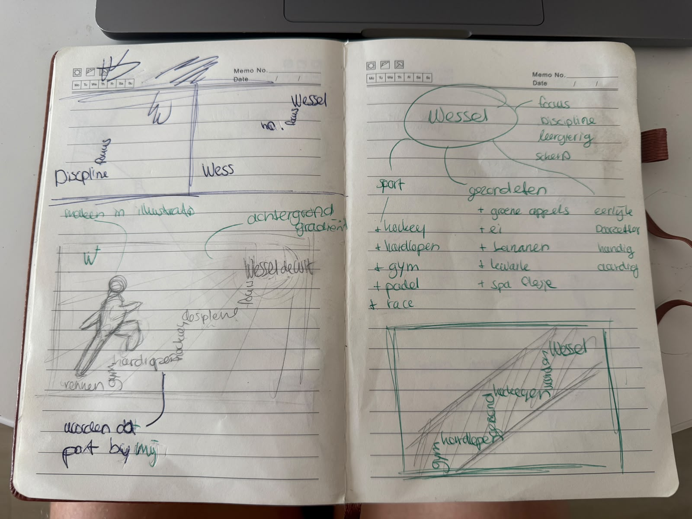
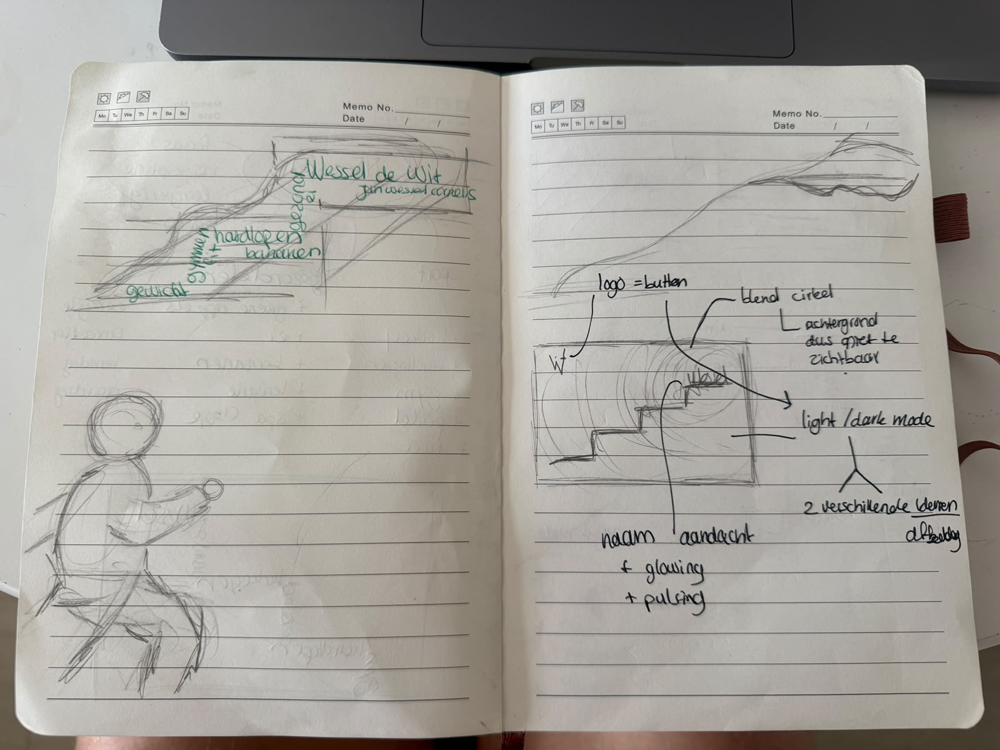
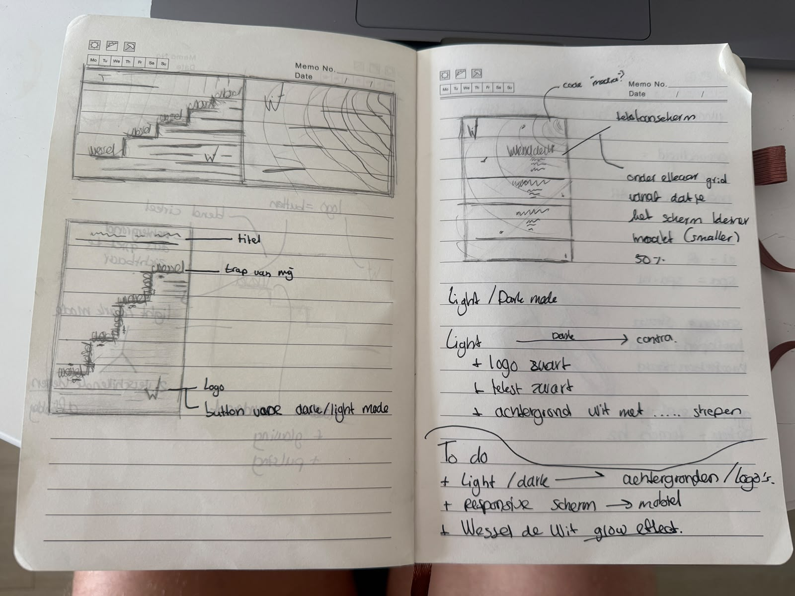
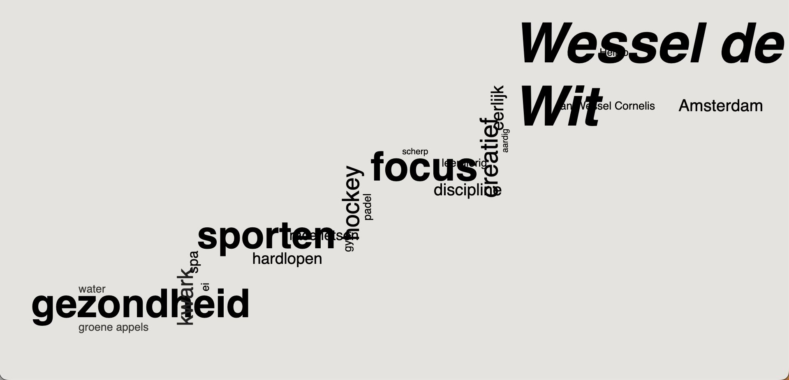

# Model

Het staat model voor digitale tuintjes welke bij 'Het web is voor iedereen' door studenten worden gemaakt.

## Proces van het maken van de site

### 1. Basisopzet

In de les moesten we een onderwerp verzinnen voor onze digitale garden en daar in Miro allemaal afbeeldingen bij zoeken. Mijn onderwerp dat ik had gekozen was discipline. Dit heb ik gekozen omdat ik vind dat dit goed bij mij past. In mijn leven sport ik veel en probeer ik zo gezond en gebalanceerd mogelijk te leven. Hierbij is discipline cruciaal. In eerste instantie zochten we naar afbeeldingen die erbij pasten, en daarna moesten we daar een abstracte versie van vinden. Daarbij moesten we allerlei sfeerwoorden bedenken die pasten bij het onderwerp. Wat mij opviel, zoals te zien is in de afbeelding, is dat focus — in zowel letterlijke als figuurlijke zin — veel terugkwam in de afbeeldingen die ik had gevonden.

Dit heb ik meegenomen in mijn schetsen en ben eerst begonnen met het maken van een paar Crazy 8's. Daarbij heb ik allerlei verschillende schermen gemaakt waarbij de focus uiteindelijk naar een specifiek punt gaat. Nadat ik wat ideeën had opgedaan, ben ik wireframes gaan schetsen met annotaties ter verduidelijking. Voorheen zette ik geen annotaties bij mijn schetsen, maar na de deep dive zie ik zeker in dat dit een toevoeging is, zeker als je het in verschillende kleuren doet.

Na een aantal schetsen gemaakt te hebben, kwam ik er uiteindelijk op uit om een poppetje (ikzelf) een berg te laten beklimmen, met bepaalde punten die dan buttons moesten voorstellen. Daarop zou je dan kunnen drukken en informatie zien. Dit was een leuk idee, maar er zat zeker nog verbetering in. Toen kwam ik op het idee om de trap te maken uit woorden die van groot belang zijn in mijn leven, waarbij uiteindelijk aan het einde van de trap mijn volledige naam te lezen is. Nadat ik dit idee volledig op papier had staan, ben ik gaan coderen.

Bij het coderen ben ik in eerste instantie begonnen met wat ik al wist van vorig jaar: met simpele classes alle woorden erin zetten, zodat ik elk woord individueel kan stylen. De site moest echter ook responsive zijn, dus ben ik met de theorie uit de deep dives aan de slag gegaan. Ik heb geprobeerd zoveel mogelijk te gebruiken van wat er beschikbaar was en wat goed zou staan op mijn site.

### 2. Belangrijkste keuzes en waarom

Voor het lettertype ben ik op zoek gegaan naar een duidelijk font. Ik heb uiteindelijk voor twee fonts gekozen: één voor de belangrijkste woorden en één voor de minder belangrijke woorden, zodat er een duidelijke hiërarchie in de trap zit.

De achtergrond heb ik zelf gemaakt in Illustrator, in een light- en een dark-versie, passend bij de light/dark-modus van de site.

Daarnaast heb ik mijn eigen logo verwerkt. Dat logo had ik al eerder gemaakt: ik gebruik het ook bij mijn portfolio en als handtekening onder mijn schilderijen. Ik vond het leuk om dat terug te laten komen op mijn digital garden, zodat de site ook op dat vlak echt van mij is.

### 3. Wat ik onderweg tegenkwam en hoe ik het oploste

### 4. Feedback die ik heb verwerkt

### 5. Wat ik nog zou willen verbeteren

## Learning Log

Alle checkout-vragen uit de DLO, op chronologische volgorde.

### Sprint 0 - Getting a grip

#### Ma: Kickoff

1. Leg uit wat een source hosting platform is en voor welke jij gekozen hebt.

Antwoord: Een source hosting platform is een tool waarin je je code kan maken en opslaan. Wat ik heb gekozen is Visual Studio Code omdat we daar vorig jaar ook al mee hebben gewerkt.

2. Vertel welke domeinnaam jij gekozen hebt en hoe je die hebt gekoppeld aan jouw pagina.

Antwoord: Ik heb als domeinnaam [wesseldewit.nl](http://wesseldewit.nl) gekozen en die heb ik dmv github live gekregen.

3. Beschrijf hoe je aanpassingen aan jouw pagina kunt maken en hoe je er voor zorgt dat die op het web gepubliceerd worden.

Antwoord: Wanneer ik op mijn vscode een wijziging maak kan ik het daarna via de github desktop pushen naar mijn live website.

### Sprint 1 - Digital Garden

#### Ma: Sprintplanning + WS 1

1. Leg uit wat een digital garden is en waarom dat anders is dan een reguliere website.

Antwoord: Je digital garden is een website die je maakt naar eigen zin. Je kiest een onderwerp en een style dat bij je past als persoon. Uiteindelijk wordt deze site een soort identiteit/portfolio van jezelf.

2. Leg uit wat een website 'webby' maakt en welke websites jou het meeste inspireren.

Antwoord: Ik heb eigenlijk geen websites die mij inspireren.

3. Vertel waar jij mee aan de slag wilt gaan bij het maken van jouw eigen digital garden (let op: dit zijn jouw eerste ideeën, dit kan en mag veranderen in de loop van het programma).

Antwoord: Als onderwerp kies ik iets wat dicht bij mij staat, dingen waar ik veel mee bezig ben zoals sporten en gezond leven.

#### Wo: WS 2

1. Leg uit waar het Visual Research in 3 stappen naartoe werkt.

Antwoord: Luisteren naar de doelgroep, daarvoor ontwerpen en dat dan delen.

2. Vertel in 2 zinnen waar jouw Garden over gaat, en met welke content je dat gaat doen (beeld, tekst, sound, animatie enz.).

Antwoord: Mijn garden wordt een trap met allerlei woorden. Al die woorden bij elkaar maken mij tot wie ik ben.

3. Vertel kort welk idee van de Crazy 8 je het liefst zou willen uitvoeren/verder zou willen onderzoeken.

Antwoord: Ik wil dat de focus gaat naar één punt. (mijn naam)

(Vr: WS 3 + Voortgang had geen checkout.)

#### Ma: WS 4 + Bi-weekly geek 1

1. Leg uit wanneer een website 'lelijk' wordt en geef voorbeelden wat je kan doen om deze 'lelijke' onderdelen te fixen.

Antwoord: Wanneer een website niet meebeweegt met de grootte van het scherm wordt dit als lelijk beschouwd.

2. Vertel welke volgende stap je neemt om je website responsive te maken.

Antwoord: @media

3. Kun je het ontwerp en de bouw van je eigen Garden (zo uit je hoofd) onderbouwen in Webby vocabulair?

Antwoord: Nee, dat kan ik helaas niet.

#### Wo: Workshop 5

1. Noem 3 Gestalt- of Design principes op en laat de ander uitleggen wat ze betekenen en doen.

Antwoord:
- Nabijheid; wanneer iets bij elkaar staat ziet het er uit als een.
- Gelijkheid; wanneer iets dezelfde vorm of kleur heeft.
- Continuïteit; wanneer lijnen of vormen dezelfde kant op gaan zien we het als een.

2. Een grid biedt ruimte om te spelen (vrijheid), maar tegelijkertijd ook eenheid en structuur (vastigheid). Wat wordt hiermee bedoeld?

Antwoord: Doordat je iets in een grid zet kan je daarmee overzicht creëren wat op verschillende groottes hetzelfde blijft.

3. Welk principe neem je mee in een laatste iteratie van je eigen Garden?

Antwoord: Doordat alle woorden op een bepaalde manier gepositioneerd zijn zie je een trap (nabijheid gestalt-principe).

(Vr: Voortgang + Retrospect had geen checkout.)
